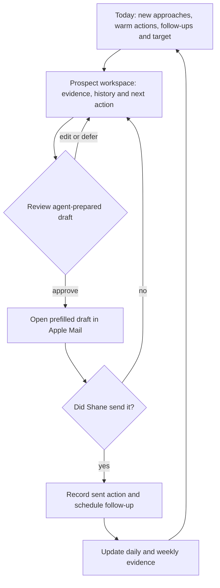
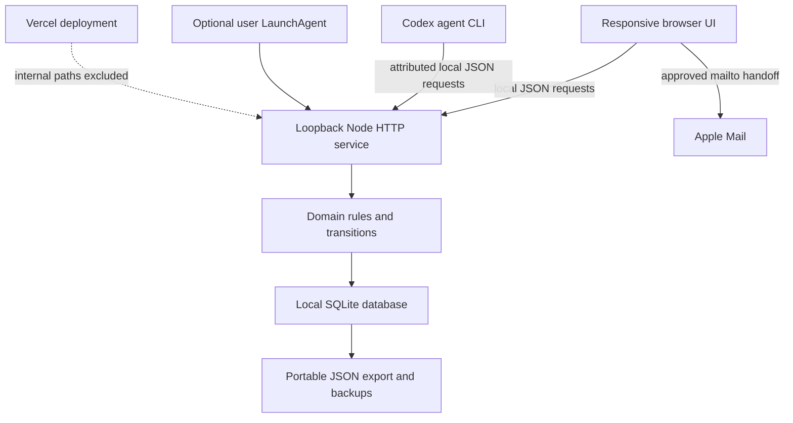
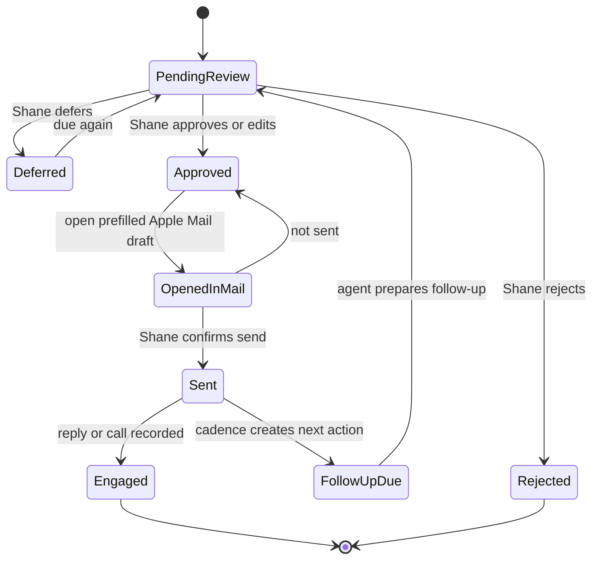

# Outreach Desk - Plan

## Goal Capsule

- **Objective:** Create a local-first Outreach Desk that helps Shane and Codex agents complete the founder-led email acquisition workflow without the friction of a spreadsheet or the carrying cost of a general CRM.
- **Product authority:** This Product Contract owns the user-visible behavior and scope of Outreach Desk v1. The approved Commercial Control Sprint offer, qualification rules, outreach language and validation gates remain business authorities.
- **Execution profile:** Implement as one bounded local application, prove each work unit with its cited tests, and preserve the human-send boundary throughout.
- **Stop conditions:** Stop and return to product framing if implementation would require public hosting, automatic sending, mailbox access, a framework migration or a change to the approved outreach workflow.
- **Tail ownership:** The implementing agent owns local runtime verification, browser QA, operating documentation and cleanup of abandoned code paths. The user retains authority over installing the persistent macOS service.
- **Open blockers:** None.

---

## Product Contract

### Summary

Outreach Desk will be a local-first, single-user operating console for prospect research, agent-prepared email drafts, human approval, manual Apple Mail sending, follow-up control and validation tracking.
It will optimise daily acquisition work rather than reproduce a general CRM.

### Problem Frame

The Commercial Control Sprint is ready for market validation, but the founder still needs to identify qualified businesses, research relevant signals, prepare individual approaches, follow up consistently and preserve the market evidence generated by each interaction.

A spreadsheet can hold the information but makes the daily work feel like database administration. A general CRM would introduce configuration, irrelevant features and maintenance before the acquisition method is proven. The system must reduce the effort between opening the workspace and completing the next meaningful outreach action while keeping human judgment over every external message.

### Actors

- A1. **Shane:** owns targeting judgment, approves or edits every external message, sends through Apple Mail and records real-world outcomes.
- A2. **Codex agents:** research prospects, populate or improve records, prepare draft emails, recommend next actions and analyse accumulated evidence without authority to communicate externally.
- A3. **Apple Mail:** receives prefilled approved drafts and remains the version-one sending surface.
- A4. **Outreach Desk:** holds the shared operating record, presents the work queue, enforces approval boundaries and calculates progress.

### Key Decisions

- **Daily operating console over general CRM** (session-settled: user-approved — chosen over a comprehensive CRM: the tool must increase completed outreach rather than create administration). Governs R3–R6, R19.
- **Local-first and single-user** (session-settled: user-directed — chosen over a hosted multi-user application: the always-on Mac Mini and existing remote-workstation access provide sufficient initial availability). Governs R1, R2, R22.
- **Supervised automation first** (session-settled: user-directed — chosen over immediate automatic outreach: targeting and messaging must be proven before external communication is delegated). Governs R10–R13, R18.
- **Email-first through Apple Mail** (session-settled: user-directed — chosen over optimising LinkedIn or phone first: email provides the cleanest approval, follow-up and measurement loop). Governs R12–R16.
- **One-day version-one boundary** — The tool must support outreach this week rather than become another product-development project. Governs R1–R25 and the Scope Boundaries.

### Requirements

**Access and focus**

- R1. Outreach Desk must run locally on the always-on Mac Mini and restore its durable state after an application or machine restart.
- R2. Shane must be able to operate the essential daily workflow from a phone through the existing remote-workstation arrangement.
- R3. The first screen must show new approaches, warm actions, due follow-ups, overdue work and progress toward the current weekly activity target.
- R4. Every active prospect must have one visible next action with an owner and due date.
- R5. Shane must be able to complete, defer or dismiss a queued action without navigating through unrelated administration.
- R6. The Desk must show a clear completion state when no required acquisition work remains for the day.

**Prospect evidence and pipeline**

- R7. Each prospect must hold company details, trade, location, decision-maker, public contact route, source links, active-project or business evidence, a problem hypothesis and any warm connection.
- R8. The Desk must preserve a chronological history of research, drafts, outreach actions, replies, calls, decisions and status changes.
- R9. Prospect records must support these operational outcomes: researching, qualified, ready to contact, contacted, follow-up due, engaged, call booked, qualified opportunity, proposal sent, won, nurture, disqualified and no response.
- R10. Codex agents must be able to add or update prospect research, draft content and recommended next actions through a controlled shared interface.
- R11. Agent-prepared changes must be distinguishable from Shane's approvals and recorded real-world outcomes.

**Approval and email execution**

- R12. Every first approach and follow-up must enter an approval queue before it can be handed to Apple Mail.
- R13. Shane must be able to approve, edit, reject or defer a draft, and rejection must not send or schedule the message.
- R14. An approved draft must contain the recipient, subject, body, problem angle and supporting evidence used to personalise it.
- R15. Shane must be able to open an approved email prefilled in Apple Mail without granting Outreach Desk authority to send it.
- R16. Opening Apple Mail must not count as a sent action until Shane explicitly records that the message was sent.
- R17. Recording a sent email must timestamp the action and create the next follow-up using the approved cadence unless Shane changes or stops it.
- R18. Outreach Desk and Codex agents must never send external communication automatically in version one.

**Evidence capture and measurement**

- R19. Shane must be able to capture a reply, the prospect's exact problem language, qualification evidence, suitability-call notes, objections, a recommendation and the next action.
- R20. A positive reply, accepted introduction, confirmed relevant problem or booked suitability call must be identifiable as an engaged lead.
- R21. The weekly scorecard must count completed first approaches, warm actions, follow-ups, replies, engaged leads, calls, confirmed problems, recommendations, proposals, sales and cash collected.
- R22. Research and draft preparation must not count toward the weekly acquisition-action total until a real outreach action is recorded.

**Data control**

- R23. All operating data must remain locally durable and exportable in a standard machine-readable format.
- R24. Shane must be able to back up and restore the complete operating record without a vendor account.
- R25. Version one must support at least the initial 50-company validation list without a change in workflow.

### Daily Workflow Shape

### Key Flows

- F1. Agent prepares a prospect
  - **Trigger:** A2 identifies or is assigned a potentially qualified business.
  - **Actors:** A2, A4.
  - **Steps:** The agent records the public evidence and decision-maker, states a bounded problem hypothesis, prepares a draft and assigns the next review action to Shane.
  - **Outcome:** A complete prospect record appears in Shane's queue without any external communication.
  - **Covered by:** R7, R10–R14.

- F2. Shane approves and sends an email
  - **Trigger:** A1 opens a queued first approach or follow-up.
  - **Actors:** A1, A3, A4.
  - **Steps:** Shane reviews the evidence and draft, edits or approves it, opens the prefilled message in Apple Mail, sends it manually and returns to record the sent outcome.
  - **Outcome:** The action is timestamped and the appropriate next follow-up becomes visible.
  - **Covered by:** R12–R18.

- F3. Shane records a reply or conversation
  - **Trigger:** A prospect responds or participates in a suitability conversation.
  - **Actors:** A1, A2, A4.
  - **Steps:** Shane captures the response and exact language, updates qualification and outcome, and records the next action; an agent may then prepare analysis or a later draft.
  - **Outcome:** The pipeline and evidence record reflect what happened rather than what the team hoped would happen.
  - **Covered by:** R8, R9, R19–R21.

- F4. Shane runs the daily acquisition block
  - **Trigger:** A1 opens Outreach Desk at the start of the protected acquisition period.
  - **Actors:** A1, A2, A4.
  - **Steps:** The Desk presents due work, Shane processes actions, agents prepare new records and drafts, and progress updates only from completed real-world actions.
  - **Outcome:** Shane either reaches the daily objective or sees the exact remaining acquisition work.
  - **Covered by:** R3–R6, R21, R22.

### Acceptance Examples

- AE1. Human approval remains mandatory
  - **Covers R12, R13, R18.**
  - **Given:** An agent has prepared a complete personalised email.
  - **When:** Shane has not approved it.
  - **Then:** The draft remains internal and no external communication occurs.

- AE2. Apple Mail handoff is not a sent event
  - **Covers R15–R17.**
  - **Given:** Shane approved a draft and opened it in Apple Mail.
  - **When:** He closes or abandons the Apple Mail draft.
  - **Then:** Outreach Desk does not count the email as sent or schedule its follow-up.

- AE3. A sent email creates follow-up work
  - **Covers R16, R17, R21.**
  - **Given:** Shane sent an approved first approach in Apple Mail.
  - **When:** He records the message as sent.
  - **Then:** The action counts once and the next follow-up appears on the correct due date.

- AE4. Engagement stops a generic follow-up sequence
  - **Covers R8, R9, R19, R20.**
  - **Given:** A prospect has an automatic next follow-up due.
  - **When:** Shane records a reply, accepted introduction, confirmed problem or booked call.
  - **Then:** The generic sequence stops and the prospect receives a new explicit next action.

- AE5. An opt-out or disqualification prevents more outreach
  - **Covers R4, R8, R9, R13.**
  - **Given:** A prospect asks not to be contacted or is disqualified.
  - **When:** Shane records that outcome.
  - **Then:** No new outreach action or draft is placed in the active queue for that prospect.

- AE6. Restart preserves operating state
  - **Covers R1, R23, R24.**
  - **Given:** The Desk contains prospects, actions, notes and drafts.
  - **When:** The application or Mac Mini restarts.
  - **Then:** The same durable records and due work are available when the Desk reopens.

### Success Criteria

- Shane can open the Desk and identify the next required action without consulting another tracker.
- The first ten researched prospects can move from agent preparation through approval, Apple Mail handoff and follow-up scheduling without missing information.
- The initial 50-company list remains usable and searchable as its activity history grows.
- No external email can be sent by Outreach Desk or a Codex agent in version one.
- Weekly activity and validation-gate evidence can be reviewed without manual recounting.
- All prospect and activity data can be exported and restored.
- The version-one scope remains small enough to implement in one focused build day; lower-priority convenience features are removed before this boundary is exceeded.

### Scope Boundaries

**Deferred for later**

- Direct secure access from a phone without using the existing remote-workstation arrangement.
- Automatic email sending after targeting, message quality, compliance controls and conversion evidence are proven.
- Mailbox synchronisation, automatic reply capture and automatic activity logging.
- Deeper LinkedIn, phone and warm-introduction workflows.
- Agent-driven outreach scheduling or autonomous campaign management.

**Outside this product's identity**

- A general CRM for account management, customer success or service delivery.
- A public multi-user SaaS product.
- Bulk-email marketing, content production, paid-advertising management or lead-magnet creation.
- Proposal generation, invoicing, payment collection and Commercial Control Sprint fulfilment.

### Dependencies and Assumptions

- The Mac Mini remains available during normal use and the existing remote-workstation arrangement remains the phone-access path for version one.
- Apple Mail is configured with the business sending account, is the Mac's default email handler and remains the authoritative sending surface. The operating checklist verifies this dependency; copy controls remain the non-sending fallback if the association changes.
- Shane records sent messages and real-world outcomes honestly because version one does not read the mailbox.
- Codex agents can access Outreach Desk through the role-scoped local interface specified in KTD4.
- Codex agents are cooperative local actors. Because they may share Shane's macOS account and filesystem access, version one's role restrictions are enforced by the supported interface and audit trail rather than by OS-level isolation.
- The macOS user account and FileVault protect local prospect data at rest; Outreach Desk adds owner-only file permissions but does not implement separate database encryption in version one.
- The approved sales playbook remains the authority for targeting, message boundaries, follow-up cadence and suitability-call decisions.

### Sources and Research

- `api/leads.js` confirms that the current site provides protected read access to inbound waitlist and contact submissions but no editable outbound pipeline.
- `api/calculator-lead.js` confirms that inbound calculator leads are stored and notified separately from founder-led prospecting.
- `package.json` confirms that the current application footprint is small and does not already include an internal CRM or dashboard framework.

---

## Planning Contract

Product Contract preservation: unchanged.

### Key Technical Decisions

- KTD1. **Build a separate zero-framework local service** (session-settled: user-approved — chosen over a hosted or framework-based application: the existing Node runtime can deliver the confirmed scope within the one-day boundary). Implement the UI as browser-native HTML, CSS and ECMAScript modules served by a small Node HTTP process. Governs R1–R6, R25.
- KTD2. **Use the installed Node 24 runtime and built-in SQLite** (session-settled: user-approved — chosen over browser storage and a native database dependency: shared durable state must be queryable by both the UI and agents without adding installation friction). Require Node 24.15 or newer, apply ordered schema migrations on startup and keep portable JSON export as the recovery boundary. Governs R1, R7–R11, R23–R25.
- KTD3. **Keep the service loopback-only and exclude it from Vercel** (session-settled: user-approved — chosen over direct network exposure: phone access will use the existing remote-workstation path). Bind only to `127.0.0.1`, accept only the configured loopback host and origin, require JSON mutations plus an application-issued anti-forgery token, and exclude the entire internal application and its data paths from deployment uploads. These controls protect against hostile webpages and accidental network exposure; they do not claim isolation from software already running with Shane's macOS account privileges. Governs R1, R2, R23, R24.
- KTD4. **Give agents role-scoped domain actions through a local interface** (session-settled: user-approved — chosen over UI-only operation: agents must prepare work through the same product rules). Provide a thin command-line client over the local JSON API, identify its actor as an agent, allow only research, prospect, draft and next-action preparation operations, and use optimistic record versions so conflicting writes fail visibly. Shane-only operations—approval, sent confirmation and real-world outcome recording—remain unavailable to the agent client. This is an application workflow boundary, not a security sandbox against an agent with arbitrary local file or process access. Governs R4, R7–R14, R19–R22.
- KTD5. **Separate current state from immutable activity history.** Keep current prospect, action and draft records for fast work queues while appending every approval, send confirmation, reply and status transition as an attributed event. This gives scorecards and audit history one source without forcing event-sourced reconstruction. Governs R8, R9, R11, R16, R17, R19–R22.
- KTD6. **Use RFC 6068 `mailto:` handoff for Apple Mail.** Generate only recipient, subject and plain-text body fields, percent-encode them correctly and never treat navigation to the URI as evidence of sending. Provide copy controls as a non-sending fallback when a client refuses or truncates a long URI. Governs R12–R18.
- KTD7. **Model queue work as explicit actions.** A prospect's pipeline state describes the relationship; separate dated actions describe what must happen next. Queue, completion and scorecard behavior derive from action state rather than from overloaded prospect statuses. Governs R3–R6, R9, R17, R21, R22.
- KTD8. **Use the stable Node test runner plus real-browser QA.** Keep domain, persistence, API, encoding and aggregation logic in testable modules exercised by `node:test`; verify responsive layout, Apple Mail handoff and completion-state behavior in a real browser on desktop and phone-sized viewports. Governs all verification work.

### High-Level Technical Design

The implementation is a local system with one durable authority. Browser and agent clients call the same domain service, which owns validation, transactions, attribution and event creation.

Draft and action lifecycles remain separate so a mail-client handoff cannot silently become a completed outreach action.

### Data and Interface Boundaries

- **Prospects:** current company, contact, evidence, qualification and pipeline state with an optimistic version.
- **Actions:** owner, type, due date, state and completion outcome for daily work and activity counts.
- **Drafts:** recipient, subject, body, evidence basis, review state and link to the action they support.
- **Events:** append-only attributed history used for timelines and scorecard facts.
- **Settings:** weekly targets, approved follow-up cadence and local operating preferences.
- **Local API:** resource-oriented JSON operations for the browser and CLI; every mutation passes through domain validation and a transaction.
- **Browser authority:** application-issued anti-forgery state, strict loopback host/origin checks and Shane-only mutations for approval, sent confirmation and recorded real-world outcomes.
- **Agent CLI:** narrow role-scoped commands for research, prospect updates, draft creation and next-action proposals; it has no approval, sent-confirmation or real-world-outcome command.

### Sequencing and Constraints

1. Establish persistence, migrations and local-server boundaries before adding domain behavior.
2. Implement prospect, action, event and agent-parity rules before the visual workspace.
3. Add approval and Apple Mail handoff only after action history can distinguish opened from sent.
4. Add aggregation, backup and persistent operation after the end-to-end daily flow works.
5. Keep the marketing site and existing inbound APIs unchanged except for deployment-exclusion and root convenience scripts.
6. Treat the one-day boundary as a scope-discipline target, not permission to waive the Definition of Done: get the U1–U4 daily outreach loop working first, cut only deferred convenience, and complete U5–U6 verification before final handoff.

### System-Wide Impact

- **Deployment:** `internal/`, local data, tests and planning artifacts must be excluded from Vercel uploads; a deployment dry-run must prove the internal app is absent.
- **Inbound leads:** existing waitlist, contact and calculator capture remain separate and unchanged in version one.
- **Data lifecycle:** all mutable outreach data lives in the local SQLite file; exports and pre-restore backups are the recovery path.
- **Network boundary:** the service listens only on loopback, so the existing remote-workstation session is the sole remote-access mechanism.
- **Local security boundary:** the service rejects unexpected hosts, origins and non-JSON mutations; database, configuration, exports, backups and logs use owner-only permissions. macOS account access and FileVault remain the at-rest security boundary.
- **Agent parity:** every permitted agent mutation uses the same domain validation as the browser, returns the resulting version and emits an attributed event; parity does not expand the agent's role-scoped operation allowlist.
- **Human authority:** no API route, CLI command or UI control may send email or infer sending from Apple Mail launch.
- **Brand and accessibility:** use the existing Leveraged Systems tokens and typography conventions while keeping status communication understandable without colour alone.

### Risks and Mitigations

| Risk | Consequence | Mitigation |
|---|---|---|
| Built-in SQLite is release-candidate quality in Node 24 | A runtime change could affect local persistence | Pin the supported Node 24 minimum, use a small documented API subset, run migration and backup tests, and preserve portable exports |
| Internal files reach a Vercel deployment | Prospect data or private tooling could become publicly reachable | Keep live data ignored by git, exclude the internal tree with `.vercelignore`, and inspect the deployment manifest before release |
| A hostile webpage targets the loopback API | Prospect data could be changed through cross-site requests | Enforce the configured loopback host and origin, require JSON mutations plus an application-issued anti-forgery token, and reject cross-origin access |
| A process running as Shane's macOS user reads or changes local files | Contact data or the human-approval record could be bypassed | Use owner-only permissions and FileVault, document that the agent boundary is cooperative rather than OS-isolated, and preserve attributed events for detection and recovery |
| `mailto:` encoding or client limits corrupt a draft | Shane could send incomplete or malformed outreach | Test UTF-8 and reserved characters, keep messages concise, show the final text before handoff and provide copy controls |
| UI and agent update the same record | Work or evidence could be overwritten | Require record versions, reject stale mutations and preserve attributed events |
| Manual send confirmation is forgotten or falsified | Follow-ups and scorecards become inaccurate | Keep opened drafts visibly unresolved until Shane confirms sent or not sent; never auto-assume success |
| A one-day build expands into CRM work | Outreach is delayed by internal tooling | Enforce the Product Contract boundary and cut deferred convenience before adding dependencies or adjacent modules |

### Sources and Research

- [Node.js v24 SQLite documentation](https://nodejs.org/download/release/latest-v24.x/docs/api/sqlite.html) supports a file-backed built-in database and backup operations, while marking the module release-candidate quality.
- [Node.js v24 test-runner documentation](https://nodejs.org/download/release/latest-v24.x/docs/api/test.html) provides the stable dependency-free test harness selected in KTD8.
- [RFC 6068](https://www.rfc-editor.org/rfc/rfc6068.html) defines the `mailto:` subject and body fields, required percent encoding and the user-approval expectation that reinforces R18.
- [Vercel `.vercelignore` documentation](https://vercel.com/docs/deployments/vercel-ignore) establishes the repository-root exclusion mechanism selected in KTD3.
- [Vercel's dry-run deployment release](https://vercel.com/changelog/dry-run-deployments-with-vercel-cli) establishes `vercel deploy --dry --format=json` and requires Vercel CLI 54.17.2 or newer; the currently installed 50.25.0 must be upgraded before the deployment-isolation gate runs.

---

## Implementation Units

### U1. Local runtime and durable store

- **Goal:** Establish the loopback-only service, SQLite schema, migrations and restart-safe storage boundary.
- **Requirements:** R1, R7–R11, R23–R25; AE6; KTD2, KTD3, KTD5.
- **Dependencies:** None.
- **Files:**
  - `internal/outreach-desk/server.mjs`
  - `internal/outreach-desk/lib/database.mjs`
  - `internal/outreach-desk/lib/migrations.mjs`
  - `internal/outreach-desk/lib/repository.mjs`
  - `internal/outreach-desk/config.example.json`
  - `.gitignore`
  - `test/outreach-desk/database.test.mjs`
- **Approach:**
  1. Add a startup runtime guard for the supported Node 24 version and create the local data directory outside tracked source with owner-only directory and file permissions.
  2. Open one file-backed database with foreign keys and transactions enabled, then apply idempotent numbered migrations.
  3. Implement repository operations for prospects, actions, drafts, events and settings with optimistic versions and explicit actor metadata.
  4. Bind the HTTP server to loopback, validate the configured host and origin, issue anti-forgery state to the application shell, reject cross-origin or non-JSON mutations, and serve health plus static-app entry points without touching the Vercel API handlers.
- **Patterns to follow:** Use ECMAScript modules and small dependency-free functions like the existing `api/` handlers; keep internal styles isolated from `styles.css`.
- **Test scenarios:**
  1. Starting against an empty temporary directory creates the schema and default settings once.
  2. Restarting against an existing database preserves prospects, actions, drafts and events without rerunning destructive migrations.
  3. A stale record version rejects the second writer and leaves the first write intact.
  4. A failed multi-record mutation rolls back all rows and emits no partial event.
  5. Unsupported Node versions fail before opening or mutating the database.
  6. Fifty populated prospects plus their actions and histories remain queryable in deterministic order.
  7. Unexpected host headers, cross-origin requests, missing anti-forgery state and mutation content types other than JSON are rejected without changing data.
  8. The database, configuration and local data directory are created with owner-only permissions.
- **Verification:** A temporary file-backed database passes migration, transaction, restart, version-conflict and capacity tests; the service reports a healthy loopback runtime.

### U2. Prospect, action and agent domain interface

- **Goal:** Implement the shared domain operations that power both Shane's browser and Codex agent preparation.
- **Requirements:** R3–R11, R19, R20, R22; F1, F3, F4; AE4, AE5; KTD4, KTD5, KTD7.
- **Dependencies:** U1.
- **Files:**
  - `internal/outreach-desk/lib/domain.mjs`
  - `internal/outreach-desk/lib/routes.mjs`
  - `internal/outreach-desk/agent-cli.mjs`
  - `test/outreach-desk/domain.test.mjs`
  - `test/outreach-desk/api-agent-parity.test.mjs`
- **Approach:**
  1. Define one set of domain operations for prospect creation, qualification, evidence, status transitions, next actions, replies and call notes.
  2. Expose operations through the local JSON routes and a narrow CLI that submits attributed, role-scoped requests to the running service.
  3. Return current versions and resulting events from mutations so both clients can refresh rather than guess state.
  4. Enforce suppression for opt-out, disqualified and no-response terminal outcomes before accepting new outreach work.
- **Execution note:** Start with domain and API contract tests so the agent interface cannot acquire behavior unavailable to the UI.
- **Patterns to follow:** Keep transport parsing in routes and business rules in domain modules; use the error-object style already present in `api/` responses without coupling to Vercel.
- **Test scenarios:**
  1. An agent creates a qualified prospect with evidence, a draft proposal action and visible agent attribution.
  2. The browser performs the same operation and receives an equivalent resulting record and event shape.
  3. Missing decision-maker, evidence source or next-action fields produce actionable validation errors without partial writes.
  4. Recording a positive reply marks the prospect engaged and replaces a generic follow-up with an explicit next action.
  5. Recording opt-out or disqualification cancels active outreach actions and rejects later draft creation.
  6. Concurrent CLI and browser updates return a visible conflict to the stale client.
  7. The CLI exposes no operation that can approve a draft, mark an email sent or record replies and calls reserved for Shane.
- **Verification:** Browser-facing routes and CLI commands produce the same validated domain outcomes, attribution and history for equivalent inputs.

### U3. Responsive Today view and prospect workspace

- **Goal:** Deliver the calm daily queue, prospect evidence workspace and phone-usable interaction loop.
- **Requirements:** R2–R9, R19, R20, R25; F3, F4; AE4, AE5; KTD1, KTD7.
- **Dependencies:** U1, U2.
- **Files:**
  - `internal/outreach-desk/public/index.html`
  - `internal/outreach-desk/public/app.css`
  - `internal/outreach-desk/public/app.js`
  - `internal/outreach-desk/public/view-model.mjs`
  - `test/outreach-desk/view-model.test.mjs`
  - `test/outreach-desk/static-app.test.mjs`
- **Approach:**
  1. Build four shallow views: Today, Prospects, Scorecard and Data, with Today as the default.
  2. Present action groups in urgency order and keep one primary action visible per item.
  3. Combine evidence, history, current state and next action in the prospect workspace without exposing database concepts.
  4. Collapse the desktop workspace to one column and sticky primary actions at phone widths used through remote desktop.
  5. Use the established brand tokens, neutral status treatments and visible text labels rather than Variation Shield status colours.
  6. Define loading, empty, saving, validation-error, stale-version conflict and retry states for every mutating view; preserve unsaved text when a recoverable request fails.
  7. Support keyboard operation, visible focus, programmatic labels, announced status changes and touch targets suitable for the phone-sized remote-workstation view.
- **Patterns to follow:** Follow `DESIGN_TOKENS.md` and the IBM Plex typography already established in `styles.css`; keep the internal application stylesheet independent.
- **Test scenarios:**
  1. Due and overdue actions sort ahead of later work while completed, dismissed and deferred items leave the active queue.
  2. A prospect with no current next action is visibly flagged instead of silently disappearing.
  3. Completing the final required action produces the daily completion state without erasing history.
  4. View-model filters preserve terminal suppression and do not offer outreach on opted-out or disqualified prospects.
  5. Static assets and unknown application routes are served safely without exposing files outside the internal public directory.
  6. Desktop and phone-sized browser QA confirms the primary action, evidence, draft review and navigation remain usable without horizontal scrolling.
  7. Slow, failed and stale-version requests show a recoverable state without losing unsaved research, notes or draft text.
  8. Keyboard-only and screen-reader smoke checks cover navigation, forms, draft decisions, confirmation prompts and status updates.
  9. An end-to-end check from Shane's configured phone remote-workstation client confirms the essential daily workflow is operable in the actual access path, not only in an emulated viewport.
- **Verification:** Shane can begin from Today, reach any prospect in one navigation step, complete or defer work and identify the next required action on desktop and phone-sized viewports.

### U4. Human-approved Apple Mail workflow

- **Goal:** Implement draft review, Apple Mail handoff and explicit sent confirmation without any automatic-send path.
- **Requirements:** R12–R18; F2; AE1–AE5; KTD6, KTD7.
- **Dependencies:** U2, U3.
- **Files:**
  - `internal/outreach-desk/lib/email-handoff.mjs`
  - `internal/outreach-desk/public/app.js`
  - `internal/outreach-desk/public/view-model.mjs`
  - `test/outreach-desk/email-handoff.test.mjs`
  - `test/outreach-desk/email-lifecycle.test.mjs`
- **Approach:**
  1. Render pending drafts with their evidence basis and allow approve, edit, reject or defer before handoff.
  2. Build standards-compliant `mailto:` URIs from approved recipient, subject and plain-text body values, with Apple Mail configured as the Mac's default email handler.
  3. Move the draft only to an opened state after handoff, then require Shane to choose sent or not sent.
  4. On sent confirmation, append the activity event and create the cadence-derived follow-up transactionally.
  5. Offer copy-recipient, copy-subject and copy-body controls without adding any sending integration.
- **Execution note:** Prove the no-send and opened-versus-sent paths before polishing the composer.
- **Patterns to follow:** Use RFC 6068 as the encoding authority; keep all activity counting behind the domain operation rather than in browser state.
- **Test scenarios:**
  1. Covers AE1. An unapproved, rejected or deferred draft cannot produce a mail handoff or sent activity.
  2. Covers AE2. Opening Apple Mail leaves the draft unresolved and adds no activity or follow-up.
  3. Covers AE3. Confirming sent records one activity and one correctly dated follow-up even if the confirmation control is pressed twice.
  4. Covers AE4. Recording engagement before a follow-up cancels the generic sequence and requires a new explicit action.
  5. Covers AE5. An opted-out or disqualified prospect cannot receive a new draft or handoff.
  6. Reserved characters, line breaks and non-ASCII text round-trip through the generated URI without changing the reviewed content.
  7. Invalid recipient addresses or blank subjects fail visibly before Apple Mail opens.
  8. Browser QA on the configured Mac confirms the handoff opens Apple Mail; changing the default handler leaves copy controls usable and does not record a sent event.
- **Verification:** No automated-send surface exists; every sent event is traceable to a Shane confirmation after an approved draft, and Apple Mail receives the reviewed content intact.

### U5. Scorecard, export and recovery

- **Goal:** Turn attributed activity into the weekly validation scorecard and provide complete portable recovery.
- **Requirements:** R20–R25; F4; AE6; KTD2, KTD5, KTD7.
- **Dependencies:** U1, U2, U4.
- **Files:**
  - `internal/outreach-desk/lib/reporting.mjs`
  - `internal/outreach-desk/lib/backup.mjs`
  - `internal/outreach-desk/public/app.js`
  - `internal/outreach-desk/public/view-model.mjs`
  - `test/outreach-desk/reporting.test.mjs`
  - `test/outreach-desk/backup-restore.test.mjs`
- **Approach:**
  1. Aggregate scorecards from attributed completed events within Australia/Melbourne week boundaries.
  2. Show the approved 50 cold, 20 warm and 30 follow-up weekly targets plus funnel outcomes without counting research or drafts.
  3. Export versioned JSON containing settings and every domain record, write it with owner-only permissions and never include its contents in application logs.
  4. Validate imports fully, create a pre-restore database backup and replace data transactionally only after confirmation.
- **Patterns to follow:** Keep reporting queries and backup logic server-side so agents and the UI see identical facts.
- **Test scenarios:**
  1. Sent cold, sent warm and completed follow-up events count once in the correct weekly buckets.
  2. Research, drafts, Apple Mail opens, rejected messages and deferred actions do not count as acquisition actions.
  3. Replies, engaged leads, calls, problems, recommendations, proposals, sales and cash aggregate from their owning events.
  4. Melbourne week boundaries assign Sunday and Monday events correctly across daylight-saving transitions.
  5. Export followed by restore reproduces prospects, actions, drafts, events, settings, versions and attribution.
  6. Invalid or unsupported export versions fail before any live data changes.
  7. A restore failure leaves the original database intact and produces a usable pre-restore backup.
  8. Exports and pre-restore backups are owner-readable only, and their contents never appear in application logs or error responses.
- **Verification:** The scorecard reconciles exactly to event fixtures, and a clean database restored from export is equivalent to the source dataset.

### U6. Local operation and deployment isolation

- **Goal:** Make the Desk easy to start, optionally persistent across login, safely excluded from Vercel and operable without hidden maintenance knowledge.
- **Requirements:** R1, R2, R23–R25; AE6; KTD1–KTD3, KTD8.
- **Dependencies:** U1–U5.
- **Files:**
  - `internal/outreach-desk/README.md`
  - `internal/outreach-desk/launchd/com.leveragedsystems.outreach-desk.plist.template`
  - `internal/outreach-desk/scripts/install-launch-agent.sh`
  - `package.json`
  - `.vercelignore`
  - `.gitignore`
- **Approach:**
  1. Add root commands for start, test, health check, agent operations and manual backup.
  2. Document foreground operation first, then provide an explicit user-run installer for a per-user LaunchAgent with absolute paths resolved at install time.
  3. Keep the database, generated configuration, logs, backups and LaunchAgent instance out of version control.
  4. Exclude the internal application, tests, plans and local artifacts from deployment uploads while leaving current marketing assets and APIs untouched.
  5. Document start, stop, health, backup, restore, upgrade and uninstall procedures, including verification that Apple Mail is the default email handler and FileVault is enabled for at-rest protection.
  6. Detect Vercel CLI versions below 54.17.2 and stop with an upgrade instruction before running the non-deploying JSON manifest check.
- **Execution note:** Treat this unit as operational packaging; prefer runtime and deployment-manifest smoke verification over additional unit abstraction.
- **Patterns to follow:** Preserve the existing root package module mode and Vercel rewrites; avoid changing public site routes or existing environment variables.
- **Test scenarios:**
  1. A fresh local start creates data in the ignored location and serves the health check plus UI on loopback.
  2. Restarting through the documented process preserves state and due work.
  3. Installing, loading, unloading and uninstalling the user LaunchAgent does not remove the database or backups.
  4. With Vercel CLI 54.17.2 or newer, `vercel deploy --dry --format=json` lists no `internal/`, `test/`, `docs/` or local data files and creates no deployment.
  5. Existing public pages and `api/` handlers remain present in the deployment manifest.
  6. LaunchAgent logs are owner-readable only and contain no prospect, draft, export or backup content.
- **Verification:** A user can start and recover the Desk from its documentation, and the deployment manifest proves internal code and data are absent while the public site remains intact.

---

## Verification Contract

| Gate | Command or method | Proves |
|---|---|---|
| Automated suite | `npm test` | Persistence, migrations, domain rules, API/agent parity, encoding, lifecycle, reporting and recovery |
| Focused local suite | `node --test test/outreach-desk/*.test.mjs` | Outreach Desk behavior without unrelated checks |
| Local health | `npm run outreach:check` | Supported runtime, loopback service and database availability |
| End-to-end browser QA | Run the U3, U4 and U5 flows in the local app at desktop and phone-sized viewports, then repeat the essential daily flow from Shane's configured phone remote-workstation client | Daily queue, prospect workspace, approval, Apple Mail handoff, scorecard, backup UX and the actual phone access path |
| Agent parity smoke | Use the documented agent CLI to create research and a draft, then review it in the browser | Shared domain behavior, attribution, versions and approval boundary |
| Restart and recovery | Restart the service, export, restore into a clean store and compare visible state | Durable storage and portable recovery |
| Deployment isolation | With Vercel CLI 54.17.2 or newer, run `vercel deploy --dry --format=json` and inspect included paths | Internal code, tests, plans and data are excluded while current public assets and APIs remain, without creating a deployment |

The browser QA must explicitly verify that no action, route or CLI command can send an email and that opening Apple Mail does not increment activity.

---

## Definition of Done

- U1–U6 satisfy every cited test scenario and observable verification outcome.
- Every Product Contract requirement R1–R25 is implemented or proven by an explicitly cited verification gate.
- Key Flows F1–F4 and Acceptance Examples AE1–AE6 pass through the browser and agent surfaces where applicable.
- The application supports the initial 50-prospect validation dataset and the full weekly scorecard without manual recounting.
- The service binds only to loopback and the Vercel dry-run manifest contains no internal application, test, plan or local-data path.
- Apple Mail receives the reviewed recipient, subject and body, but no software path sends or records sent without Shane's confirmation.
- A versioned export restores into a clean local store with equivalent records, attribution and due work.
- Operating documentation covers startup, persistent service installation, health, backup, restore and uninstall.
- Existing public pages, inbound lead APIs and website behavior remain unchanged.
- No dependency, feature or integration outside the confirmed version-one scope remains in the implementation.
- Abandoned experiments, unused modules, temporary data and dead code are removed before handoff.
